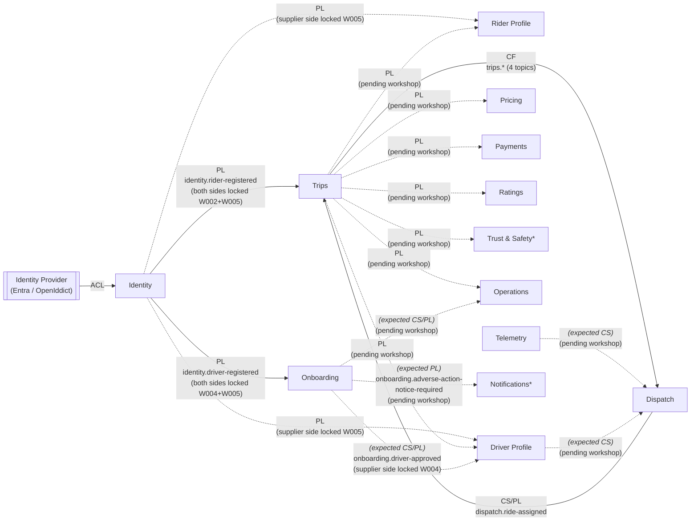

# CritterCab Context Map

This artifact names CritterCab's cross-BC relationships in DDD strategic-design vocabulary — partnership, customer-supplier, conformist, shared-kernel, published-language, anti-corruption-layer, separate-ways, open-host-service. Each cross-BC arrow on the diagram below carries one of these pattern labels, or an explicit deferral marker where the counterparty BC's workshop has not yet run.

The artifact is a **roll-up, not a re-decision**. Every relationship named here is committed elsewhere — by an ADR, a workshop, or both. The job is consolidation: gathering the distributed commitments into a single named place using the strategic-design vocabulary that [ADR-004 step #1](../decisions/004-design-phase-workflow-sequence.md) names as the workflow's foundation. Where a relationship pattern would require pre-empting a pending workshop, the artifact uses a dashed arrow with an italicized expected-pattern label rather than omitting the edge.

The artifact closes a methodology commitment that has been open since [`docs/vision/README.md` v0.1](../vision/README.md). "First-class context map" has been named as a top-line methodology goal since 2026-04-21; [ADR-004](../decisions/004-design-phase-workflow-sequence.md) names Context Mapping as the workflow's first step, a prerequisite for Event Modeling. Two workshops shipped before this artifact landed; the implicit mapping was workable at two BCs but does not scale through the seven-to-nine BCs the vision projects.

**Three cross-cutting decisions inform every per-edge prose section without appearing as edge labels in the diagram:**

- **[ADR-013](../decisions/013-shared-cross-bc-identifier.md) — shared canonical identifier.** A single UUID v7 flows across every BC participating in a ride lifecycle (`rideRequestId` = `tripId` = payment-reference-equivalent = `rideId` ...). This is a *cross-cutting value-flow primitive*, not a strategic-design relationship pattern. It appears in per-edge prose where the edge crosses a ride-lifecycle boundary, as the substrate that makes the relationship possible. Naming it a shared-kernel relationship would over-claim — ADR-013 carries the value, not the type; field names remain BC-owned at each boundary.
- **[ADR-014](../decisions/014-asb-topic-naming-convention.md) — ASB topic naming convention.** Every published-language edge that carries business events over ASB uses `<source-bc>.<event-name-kebab>` topics, session-keyed on the canonical identifier from ADR-013. Cross-referenced from every `PL` edge below.
- **[ADR-009](../decisions/009-protobuf-contracts-as-first-class-artifacts.md) — protobuf as the wire format for cross-BC contracts.** Every cross-BC contract artifact (`RideAssigned`, the four `trips.*` topic payloads, the prospective `identity.*` topics) lives as a versioned `.proto` file under `/protos/`, reviewed and evolved with the care given to API contracts.

---

## Diagram

*Trust & Safety is a candidate BC introduced by [W002 §10's](../workshops/002-trips-event-model.md) fan-out tables; it is **not** in the v0.1 vision-doc BC inventory ([`docs/vision/README.md` §Tentative Bounded Contexts](../vision/README.md)). The inventory drift is flagged in [§ Pending workshops](#pending-workshops) below.

Edge labels abbreviate the DDD strategic-design relationship pattern, paired with the carrying transport where relevant. The pattern legend is built up incrementally as edges land in this artifact:

| Abbreviation | Pattern |
|---|---|
| `CS/PL` | Customer-supplier with published language |
| `CF` | Conformist |
| `ACL` | Anti-corruption layer (the label sits on the protecting BC's side) |
| `PL` | Published language |

**Edge-style conventions:**

- **Solid arrows** are edges committed by an ADR and/or a shipped workshop. The pattern is locked.
- **Dashed arrows with italic / parenthesized labels** are edges whose relationship pattern is *expected* per existing commitments but will only be locked once the named counterparty BC's workshop ships. Each dashed edge is named in [§ Pending workshops](#pending-workshops) below with its expected-resolution trigger.
- **Subroutine-shaped nodes** (e.g., the Identity Provider) are external systems, not CritterCab bounded contexts. They appear in the diagram only where a CritterCab BC's relationship pattern is defined against them (here: ADR-006 names Identity as an ACL toward the provider).

*(Legend continues as edges #4–#6 land.)*

---

## Edges

### 1. Dispatch → Trips

**Pattern:** Customer-supplier with published language. **Direction:** Dispatch is upstream supplier; Trips is downstream customer.

Dispatch publishes `dispatch.ride-assigned` ([ADR-014](../decisions/014-asb-topic-naming-convention.md)) at the moment a driver accepts an offer ([W001 §5.10](../workshops/001-dispatch-event-model.md)); Trips consumes that publication to create its own aggregate, keyed on the canonical `tripId = rideRequestId` carried unchanged from Dispatch's `SubmitRideRequest` ([ADR-013](../decisions/013-shared-cross-bc-identifier.md)). The relationship is customer-supplier rather than conformist because the contract was *negotiated to serve Trips' needs* — `RideAssigned`'s payload denormalizes pickup, dropoff, vehicle class, fare amount, fare breakdown, pricing policy version, and notes-for-driver so that Trips can bootstrap its aggregate without round-tripping back to Dispatch ([W001 §9 protobuf surface](../workshops/001-dispatch-event-model.md)). It is published language rather than direct integration because the topic is a named contract artifact: source-BC-prefixed per ADR-014, wire-format-committed to protobuf per [ADR-009](../decisions/009-protobuf-contracts-as-first-class-artifacts.md), and durably authored as a `.proto` file in `/protos/crittercab/dispatch/v1/`.

**Tactical implementation:** [W002 slice 6.1](../workshops/002-trips-event-model.md) realizes the consumer side as a Klefter translation-slice (see [the Klefter pattern note](../research/agents-in-event-models.md)) — the inbound `dispatch.ride-assigned` topic message is translated into a local `TripMatched` decision-event, preserving Trips' independent record of having accepted responsibility for the ride. [W002 §13 forward-constraint #1](../workshops/002-trips-event-model.md) requires the consumer to be idempotent on `rideRequestId` against at-least-once redelivery.

### 2. Trips → Dispatch

**Pattern:** Conformist. **Direction:** Trips is upstream publisher; Dispatch is downstream consumer that shapes itself to Trips' published vocabulary.

Trips publishes four distinct terminal events — `trips.trip-completed`, `trips.trip-cancelled-by-rider`, `trips.trip-cancelled-by-driver`, and `trips.trip-abandoned-as-no-show` ([W002 §6.9](../workshops/002-trips-event-model.md)) — and Dispatch consumes them at its [§5.12 translation-in handler](../workshops/001-dispatch-event-model.md), mapping each topic into its own BC-owned `AssignmentOutcome` enum. The relationship is conformist rather than customer-supplier-reversed because W002 §6.9 was a *deliberate override* of W001 §5.12's preferred unified `TripTerminatedEarly` shape — the override was permitted by W001's own "preference, not constraint" framing, but Trips never reshaped its terminals to fit Dispatch's preference. Dispatch absorbed the cost on its side, including two enum gaps that surfaced as a consequence (`RIDER_NO_SHOW` added in the [§5.12 W002-update amendment](../workshops/001-dispatch-event-model.md); `ASSIGNMENT_COMPLETED_NORMALLY` deliberately not added per the implicit-happy-path scoping decision). The conformist label captures both halves of the asymmetry: Dispatch accepts Trips' published shape without negotiation, *and* Dispatch does internal translation work at the boundary to live with that shape.

**Tactical implementation:** Dispatch's slice 5.12 inbound handler is a Klefter translation-slice in its own right — each of the four `trips.*` topics maps to a local `AssignmentOutcomeRecorded` event annotating the relevant `RideRequest` aggregate, preserving Dispatch's independent post-terminal record without state-transitioning the aggregate (it is already terminal). Topic naming follows [ADR-014](../decisions/014-asb-topic-naming-convention.md); session-keying on the shared canonical `rideRequestId` per [ADR-013](../decisions/013-shared-cross-bc-identifier.md) preserves per-ride ordering for Dispatch's consumer.

#### Asymmetry across edges #1 and #2

The Dispatch ↔ Trips BC pair carries different relationship patterns per direction. At the *handoff* (Dispatch → Trips), Dispatch shaped `RideAssigned` to give Trips a fully denormalized payload for aggregate bootstrap — that's customer-supplier with published language. At the *terminal feedback* (Trips → Dispatch), Trips published its native terminal vocabulary and Dispatch shaped its consumer to absorb it — that's conformist. The asymmetry is not a defect: it reflects different negotiation dynamics at each handoff point. Dispatch had to serve Trips on the way out because Trips cannot bootstrap without rich context; Dispatch can serve itself on the way back in because the terminal signals only update an annotative outcome field.

### 3. Identity ↔ external provider; Identity → consumer BCs

**Pattern (provider-facing):** Anti-corruption layer, Identity-side. **Pattern (consumer-facing):** Published language. Two facets, one BC.

This is the strongest pre-committed relationship pattern in CritterCab: every part of it is locked by [ADR-006](../decisions/006-identity-provider-as-swappable-anti-corruption-layer.md). Identity is the single point of contact with the external identity provider — Entra External ID in production, OpenIddict in demo, Keycloak accommodated for local dev — and its primary job is *translation*: turning provider-specific lifecycle signals (Microsoft Graph change notifications, OIDC lifecycle webhooks) into domain events that the rest of the system understands. That translation is the textbook ACL pattern, and the BC's intentional thinness (ADR-006's "Identity is not a user management service or an authorization authority; it is a boundary") is the ACL discipline made visible at the strategic layer.

On the consumer-facing side, Identity publishes domain events to ASB under the [`identity.*` topic convention](../decisions/014-asb-topic-naming-convention.md). **[Workshop 005](../workshops/005-identity-event-model.md) committed the supplier side** (2026-05-28): `identity.rider-registered` and `identity.driver-registered` are the locked publications (session-keyed by the Identity-minted domain `subjectId`; raw provider `sub` never published, per ADR-006). **`identity.rider-profile-updated` was refined out** (W005 grill #1): profile data is Rider Profile's, not Identity's — the W002 §13 #2 forward-constraint conflated account-existence with profile-data, and W005 reassigned the profile-updated publication to Rider Profile's eventual workshop. The relationship is PL rather than customer-supplier because each consumer absorbs Identity's vocabulary at its own boundary; Identity is not shaping its publications to any individual consumer's needs. Proto authorship (`RiderRegistered`, `DriverRegistered`) remains a deferred follow-up (W005 §10).

**Tactical implementation (concrete):** [W002 slice 6.12](../workshops/002-trips-event-model.md) is the first concrete consumer-side translation-slice in CritterCab and the first **non-Klefter** Translation-in slice — Identity events drive Trips' `RiderProfileSnapshot` projection as pure enrichment propagation, without a local decision-event on the consumer side. This is the right-hand-side of the Klefter Post 3 figure made explicit and is the canonical shape for downstream consumers of identity events: subscribe-and-project, no local decision required. The [Klefter pattern note](../research/agents-in-event-models.md) discusses both halves of this duality.

**Concrete vs. presumed downstream consumers:**

| Consumer | Status | Translation-slice evidence |
|---|---|---|
| Trips | Concrete (solid arrow) — both sides locked | Supplier: [W005 Slice 6.1](../workshops/005-identity-event-model.md) (`identity.rider-registered`). Consumer: [W002 §6.12](../workshops/002-trips-event-model.md) — `RiderProfileSnapshot` projection. |
| Onboarding | Concrete (solid arrow) — both sides locked | Supplier: [W005 Slices 6.2/6.3](../workshops/005-identity-event-model.md) (`identity.driver-registered`, role-registration-fact). Consumer: [W004 Slice 6.1](../workshops/004-onboarding-event-model.md) — intake creates the Application stream. |
| Rider Profile | Supplier side locked (W005); consumer side dashed | Supplier: [W005 Slice 6.1](../workshops/005-identity-event-model.md). Consumer: pending Rider Profile workshop (also the new publisher of the reassigned `rider-profile-updated` per W005 grill #1). |
| Driver Profile | Supplier side locked (W005); consumer side dashed | Supplier: [W005 Slices 6.2/6.3](../workshops/005-identity-event-model.md). Consumer: pending Driver Profile workshop. |

### 4. Trips → Pricing, Payments, Ratings, Driver Profile, Rider Profile, Trust & Safety, Operations

**Pattern (supplier-side, locked):** Published language. **Pattern (consumer-side, presumed):** Conformist, pending each consumer's workshop.

The four `trips.*` topics ([W002 §6.10](../workshops/002-trips-event-model.md), [W002 §10](../workshops/002-trips-event-model.md)) fan out from Trips to seven downstream consumers — Pricing for surge and post-trip fare analytics, Payments for fare settlement, Ratings for post-trip feedback enablement, Driver Profile for performance signals and reliability scoring, Rider Profile for cancellation history, Trust & Safety for behavioral pattern detection, and Operations for live-map state and administrative tooling. Each consumer's subscription list differs (per [W002 §10's per-topic fan-out tables](../workshops/002-trips-event-model.md)) but the supplier-side discipline is uniform: distinct events per terminal type ([W002 §6.9 override](../workshops/002-trips-event-model.md)), source-BC-prefixed topic names per [ADR-014](../decisions/014-asb-topic-naming-convention.md), session-keyed by the shared canonical `tripId = rideRequestId` per [ADR-013](../decisions/013-shared-cross-bc-identifier.md). The relationship is PL rather than customer-supplier because Trips did not negotiate the publication shape with any consumer; the override of W001 §5.12's preferred unified shape was a Trips-side modeling decision, made by Trips' walk in W002 §6.9 on the rationale that distinct events better match each terminal's semantics.

Each consumer-side relationship is **presumed-conformist** by inheritance from edge #2's precedent — Dispatch is the first concrete consumer of these same topics and its slice 5.12 translation-in is a textbook conformist absorption. The consumer-side pattern locks at each consumer's workshop and may differ where a richer relationship is justified (e.g., Payments may end up customer-supplier with Trips if Payments' financial-audit obligations require Trips to evolve its publications to serve them; Operations may end up closer to separate-ways for the administrative-command flows that flow back from Operations to other BCs). These are open possibilities, not committed positions.

**Tactical implementation (presumed):** Each consumer's inbound will be either a Klefter translation-slice (where the consumer makes a local decision — e.g., Payments deciding to settle) or a non-Klefter Translation-in (where the consumer is pure projection enrichment — e.g., Driver Profile updating a reliability score) per the [Klefter pattern note](../research/agents-in-event-models.md). The specific tactical shape locks at each consumer's workshop.

**Consumer status:**

| Consumer | Status | In v0.1 vision inventory? |
|---|---|---|
| Pricing | Presumed-CF (dashed) | Yes |
| Payments | Presumed-CF (dashed) | Yes |
| Ratings | Presumed-CF (dashed) | Yes |
| Driver Profile | Presumed-CF (dashed) | Yes |
| Rider Profile | Presumed-CF (dashed) | Yes |
| Trust & Safety | Presumed-CF (dashed) | **No** — candidate BC introduced by W002 §10's fan-out; not in v0.1 inventory. Flagged in [§ Pending workshops](#pending-workshops). |
| Operations | Presumed-CF (dashed) | Yes |

### 5. Telemetry → Dispatch (deferred)

**Expected pattern:** Customer-supplier with Telemetry as upstream supplier and Dispatch as downstream customer. **Status:** Pending Telemetry workshop. Italicized label and dashed arrow on the diagram.

Telemetry is described in the [vision doc §Tentative Bounded Contexts](../vision/README.md) as the BC that owns "high-volume GPS ingest and location-of-record for active drivers" and "maintains the geospatial index that Dispatch queries." That places it unambiguously upstream of Dispatch as a supplier of geospatial data, with Dispatch as the customer consuming that supply during candidate selection ([W001 §5.3](../workshops/001-dispatch-event-model.md)). The customer-supplier expectation is firm enough that we mark it on the diagram, but it sits behind a dashed line because the *specific shape of the supplier-side discipline* is unresolved.

The open question — preserved verbatim from [W001 §10 parking-lot #4](../workshops/001-dispatch-event-model.md) and [W001 §11 ADR-candidate #3](../workshops/001-dispatch-event-model.md) — is whether Telemetry publishes raw GPS pings to Kafka (with Dispatch consuming them and maintaining its own geospatial projection inside the Dispatch BC, mediated by published language over Kafka), or whether Telemetry maintains the geospatial index as its own queryable view (with Dispatch querying via gRPC at candidate-selection time, mediated by an RPC contract). Both shapes are customer-supplier, both shapes give Dispatch the projection it needs, but they imply different consistency guarantees, different transport choices (Kafka vs. gRPC unary), and different boundary-ownership decisions.

**Tactical implementation (consumer-side, partly locked):** [W001 §5.3](../workshops/001-dispatch-event-model.md) already models `CandidatesSelected` as a Klefter Translation-in decision-event on Dispatch's side, capturing the selection's search parameters and policy version alongside the candidate list. That consumer-side translation discipline holds regardless of which transport wins — only the *supplier-side* publication/query shape is pending.

**Resolution trigger:** Telemetry workshop runs and forces the candidate-projection-ownership question to a committed answer (the trigger condition that fires [ADR-candidate #3](../workshops/001-dispatch-event-model.md)).

### 6. Intra-actor topology (deferred)

**Lens:** How a rider or driver, as an actor, flows through the BCs that own different aspects of their data. Identity owns authenticated-actor existence; profile BCs hold actor-specific domain data; Onboarding is the gating lifecycle that converts an Identity-only driver into a Driver-Profile-active driver; Driver Profile then becomes a supplier of availability state back to Dispatch at candidate-selection time. This is the topology that makes each individual edge make sense in actor-flow terms rather than in transport-or-handoff terms.

Four edges participate in this topology. Two are already on the diagram from edge #3 (Identity's outbound family); two land here for the first time. All four are dashed (pending workshops):

| Edge | Expected pattern | First captured at | Pending |
|---|---|---|---|
| Identity → Rider Profile | Published language | [Edge #3](#3-identity--external-provider-identity--consumer-bcs) | Rider Profile workshop |
| Identity → Driver Profile | Published language | [Edge #3](#3-identity--external-provider-identity--consumer-bcs) | Driver Profile workshop |
| Onboarding → Driver Profile | *Customer-supplier* | Edge #6 (new) | Both Onboarding's and Driver Profile's workshops |
| Driver Profile → Dispatch | *Customer-supplier* (structural pair with [edge #5](#5-telemetry--dispatch-deferred)) | Edge #6 (new — surfaced from W001 §5.3) | Driver Profile workshop, alongside the candidate-projection-ownership question shared with Telemetry |

**Onboarding → Driver Profile (expected CS).** The vision doc names Driver Profile as "downstream of Identity and Onboarding"; Onboarding's role as the driver-vetting lifecycle ("application, document upload, background check, approval, suspension, reinstatement") means Driver Profile cannot activate a driver until Onboarding publishes the vetting-completion signal. The relationship is expected customer-supplier with Onboarding as supplier and Driver Profile as customer. Both BCs are pre-workshop, so the specific publication shape (single completion event, distinct events per lifecycle phase, or projection-state push) is open.

**Approval-terminal-gating refinement (per [W003 §5.2 finding B2](../workshops/003-onboarding-domain-story.md)).** Domain Storytelling against the Onboarding BC surfaced an asymmetry on this edge: the cross-BC publication exists for the *approval* terminal (Story 1 step 22; Story 2 step 28) but *not* for the rejection terminal (Story 3 ends inside Onboarding with no cross-BC publication modeled). The handoff is gated by approval specifically, not by Onboarding-the-BC's terminals more broadly. Whether a rejection-terminal publication should exist (e.g., notification outbound to Trust & Safety, Operations, or anywhere else) is a [W003 OQ-10](../workshops/003-onboarding-domain-story.md) open question for W004. The vetting lifecycle is exercised by W003; the disqualification lifecycle (suspension / reinstatement / deactivation) is *not* exercised, and the vision-doc claim that Onboarding owns those concerns has been escalated to [`docs/vision/README.md`](../vision/README.md) v0.5 as an open question.

**Supplier-side lock + lifecycle-start resolution (per [W004 §6.8 + §6.9](../workshops/004-onboarding-event-model.md)).** Workshop 004's event model locks the Onboarding (supplier) side of this edge: Onboarding publishes `onboarding.driver-approved` over ASB ([ADR-014](../decisions/014-asb-topic-naming-convention.md)) on the approval terminal, session-keyed by `driverProfileId == applicationId` (the canonical UUIDv7 minted by Onboarding at `ApplicationOpened`, [ADR-013](../decisions/013-shared-cross-bc-identifier.md) fourth-participant materialization). The **lifecycle-start question W003 left open (B3) resolves to approval-push** (W004 §6.8 / W003 OQ-12): Driver Profile comes into existence *at approval*, by reacting to `onboarding.driver-approved` and creating/activating its aggregate at the inherited canonical ID — not at application-start (placeholder) and not lazily. W004 §6.9 confirms the B2 asymmetry by **explicitly locking the absence** of any cross-BC publication on the three non-approval terminals (`ApplicationRejected`, `ApplicationAbandoned`, `ApplicationWithdrawn`); Trust & Safety consumes terminal facts by *pull-via-projection* (`OnboardingTerminalFactsView`), not push-publication (W003 OQ-10e resolved). The edge **stays dashed** because the Driver Profile (consumer) side — its inbound translation shape, whether Klefter decision-event or non-Klefter enrichment — locks only when the Driver Profile workshop ships. The supplier-side discipline is committed; the consumer-side shape is the remaining pending half.

**Driver Profile → Dispatch (expected CS, structural pair with edge #5).** [W001 §5.3](../workshops/001-dispatch-event-model.md)'s `CandidatesSelected` translation-slice names "Telemetry + Driver Profile" as joint counterparty BCs for candidate selection. Driver Profile supplies driver availability state and preferences; Dispatch consumes that supply at candidate-selection time. Structurally this is a near-pair with [edge #5 (Telemetry → Dispatch)](#5-telemetry--dispatch-deferred) — same downstream-customer relationship, different supply (availability state and preferences vs. geospatial index). The same candidate-projection-ownership question that defers edge #5 also defers this one; both edges are expected to lock when [ADR-candidate #3](../workshops/001-dispatch-event-model.md) fires at the Telemetry and Driver Profile workshops respectively.

**On the Identity → Rider Profile / Driver Profile arrows:** these already sit on the diagram as dashed arrows from edge #3's outbound family. They appear under the intra-actor lens here because the actor-flow framing makes them legible as part of "how the rider/driver moves through the system's data ownership boundaries," not just as part of "Identity's published-language outbound." Same edges, two compatible readings — no diagram update needed.

### 7. Onboarding → Operations, Notifications (deferred — surfaced by W004)

**Status:** Both pending their counterparty BCs' workshops. Two new dashed edges land here for the first time, surfaced by [Workshop 004](../workshops/004-onboarding-event-model.md)'s slice walk. Structurally parallel to [edge #4 (Trips fan-out)](#4-trips--pricing-payments-ratings-driver-profile-rider-profile-trust--safety-operations) — a supplier BC fanning out to downstream consumers whose consumer-side patterns lock at each consumer's workshop.

**Onboarding → Operations (expected CS/PL).** W004 §6.6 models the Onboarding adjudicator (the first manual-human actor in any CritterCab workshop) as an actor *inside* the Onboarding BC whose decisions arrive as integration events appended to the Application's process stream. But the adjudicator's *tooling* — the queue UI, the claim flow, the SLA tracking — is Operations' concern. Onboarding owns the events (`AdjudicationCaseQueued`, `AdjudicationCaseClaimed`, `AdjudicationCaseDecided`); Operations consumes the `AdjudicatorQueueView*` multi-stream projection that aggregates them across all Application process streams. Two further Operations-facing forward-constraints surfaced: Operations owns the canonical-actor identity model for `adjudicatorId` (workforce identity, per [ADR-006](../decisions/006-identity-provider-as-swappable-anti-corruption-layer.md)'s parked workforce-Entra-tenant decision), and Operations consumes Onboarding's BG-check vendor-no-response escalation signal (W004 §6.5). The relationship is expected customer-supplier-with-published-language; whether it's CS (Operations' tooling needs shape Onboarding's projection) or pure PL (Onboarding publishes; Operations conforms) locks at the Operations workshop. **This edge also overlaps with the existing Trips → Operations dashed edge (edge #4)** — Operations is a cross-cutting consumer of multiple BCs' projections; W004 adds Onboarding as a second supplier into Operations.

**Onboarding → Notifications (expected PL).** W004 §6.7 + §6.7b model FCRA two-phase adverse-action notices (pre-adverse and final-adverse) as needing actual email/SMS delivery. Per [W003 OQ-10d / grill #3](../workshops/003-onboarding-domain-story.md), the reference-architecture-aligned shape is cross-BC publication to ASB (`onboarding.adverse-action-notice-required`, two-phase payload) rather than an Onboarding-internal `IFcraNoticeSender` integration. Notifications consumes the publication and dispatches via a SendGrid/Twilio-class vendor. The relationship is expected published-language. **Notifications is NOT in the [vision-doc tentative-BC inventory](../vision/README.md)** — same inventory-drift situation as Trust & Safety (flagged in [§ Pending workshops](#pending-workshops) below). W004 surfaces Notifications as a workshop-need-trigger without committing a vision-doc bump; whether Notifications becomes a permanent BC vs. lives inside Operations is a vision-doc-level open question. A third potential Onboarding → Notifications topic (`onboarding.applicant-approval-notification-required`, for approval-notification delivery) is named-but-deferred by W004 §6.8.

---

---

## Pending workshops

Six of the eleven BCs in the [vision-doc inventory](../vision/README.md), plus one candidate BC introduced by W002, have not yet been workshopped. Each pending workshop is expected to lock one or more dashed edges on the diagram above. Pending-workshop edges are named explicitly with their expected pattern (italicized in the diagram, restated in the per-edge prose); the dashed line marks the deferral, not the omission.

| BC | Edges this workshop is expected to lock or amend | Status note |
|---|---|---|
| Identity | **[W005 shipped 2026-05-28](../workshops/005-identity-event-model.md).** Supplier side of all outbound edges now locked (`identity.rider-registered`, `identity.driver-registered`). Identity → Trips and Identity → Onboarding are now solid (both sides modeled — W002/W004 consumers + W005 supplier). Identity → Rider Profile / Driver Profile remain dashed (consumer sides pending those workshops). | Identity is now event-modeled (**ACL-translation-dominant — CritterCab's third modeling shape**). `identity.rider-profile-updated` was refined out (reassigned to Rider Profile per W005 grill #1). Proto authorship (`RiderRegistered`, `DriverRegistered`) is the remaining deferred follow-up. ACL stance toward Entra/OpenIddict locked by [ADR-006](../decisions/006-identity-provider-as-swappable-anti-corruption-layer.md), realized concretely in W005. |
| Telemetry | [Telemetry → Dispatch (edge #5)](#5-telemetry--dispatch-deferred). [ADR-candidate #3](../workshops/001-dispatch-event-model.md) (candidate-projection-ownership) fires here. | Determines the Kafka-vs-gRPC transport call for upstream geospatial supply. Paired structurally with Driver Profile's workshop on the same ADR-candidate. |
| Driver Profile | Identity → Driver Profile (edge #3); Onboarding → Driver Profile (edge #6); Trips → Driver Profile (edge #4); [Driver Profile → Dispatch (edge #6)](#6-intra-actor-topology-deferred). | Paired with Telemetry's workshop on the candidate-projection-ownership question — same ADR-candidate #3 covers both. |
| Rider Profile | Identity → Rider Profile (edge #3); Trips → Rider Profile (edge #4). |   |
| Onboarding | Identity → Onboarding (edge #3, locked supplier-side as forward-constraint by W004); Onboarding → Driver Profile (edge #6, supplier-side locked W004); Onboarding → Operations + Onboarding → Notifications (edge #7, new). | Lifecycle BC; conversion of authenticated driver into Driver-Profile-active driver. **[W003 Domain Storytelling shipped 2026-05-26](../workshops/003-onboarding-domain-story.md)** and **[W004 Event Model shipped 2026-05-27](../workshops/004-onboarding-event-model.md)** — Onboarding's BC is now event-modeled (Process Manager via Handlers). The supplier side of every Onboarding outbound edge is locked; the *consumer* sides (Driver Profile, Operations, Notifications inbound shapes) lock at those BCs' workshops. |
| Pricing | Trips → Pricing (edge #4). Also: a deferred Dispatch → Pricing edge per [W001 §5.2](../workshops/001-dispatch-event-model.md)'s `FareQuoted` translation-out slice. | Could plausibly live inside Trips per the [vision-doc open question](../vision/README.md) about Pricing-location. The Pricing-location ADR (W001 ADR-candidate #4) fires when Pricing is actively modeled. |
| Payments | Trips → Payments (edge #4). Also: a potential Dispatch → Payments cancellation-fee edge per [W001 §5.8](../workshops/001-dispatch-event-model.md). | Most likely Polecat-on-SQL-Server candidate per the vision doc. |
| Ratings | Trips → Ratings (edge #4). | Small BC; could plausibly live inside Trips per the vision-doc open question. |
| Operations | Trips → Operations (edge #4); plus cross-cutting consumer relationships with most other BCs. | Decomposition question (operations-read vs. operations-admin) is open per the vision-doc open questions. |
| **Trust & Safety** | Trips → Trust & Safety (edge #4); Onboarding → Trust & Safety via pull-via-projection (`OnboardingTerminalFactsView`, W004 §6.9 / OQ-10e — not a push edge, so not drawn). | **Not in the v0.1 vision-doc BC inventory.** Surfaced as a candidate BC by [W002 §10's](../workshops/002-trips-event-model.md) fan-out tables (consumer of `trips.trip-cancelled-by-driver` and `trips.trip-abandoned-as-no-show`). W004 adds T&S as a pull-via-projection consumer of Onboarding's terminal facts (push-vs-pull modeling-pattern decision: pull for cross-BC information flow). Inventory drift flagged for a follow-up vision-doc tidy session — the vision doc's BC inventory will need amendment when Trust & Safety's status firms up. |
| **Notifications** | Onboarding → Notifications (edge #7, `onboarding.adverse-action-notice-required` FCRA two-phase delivery; possibly `onboarding.applicant-approval-notification-required` named-but-deferred). | **Not in the v0.1 vision-doc BC inventory.** Surfaced as a candidate BC by [W004 §6.7 / §6.7b](../workshops/004-onboarding-event-model.md) (per W003 OQ-10d / grill #3 — FCRA notices need email/SMS delivery via SendGrid/Twilio-class vendor). Same inventory-drift situation as Trust & Safety. Whether Notifications becomes a permanent BC vs. lives inside Operations is a vision-doc-level open question; W004 surfaces the need without committing a vision-doc bump. |

**Other edges noted in source materials but not drawn on the diagram:** [W001 §10 parking-lot](../workshops/001-dispatch-event-model.md) names additional candidate cross-BC relationships not yet committed in the vision-doc inventory — the road-network ETA gRPC counterparty (internal routing service, external provider via ACL, or projection on Telemetry's existing substrate) and rider-suspension propagation (Rider Profile or API gateway). These are *not* drawn because the BC on the other side is not yet committed; they are named here so the silent-omission failure mode is avoided.

---

## Update cadence

When a new BC workshop runs, the context map updates in that workshop's PR. The expectation: every workshop that touches a cross-BC relationship — by adding a new BC, locking a previously-deferred edge, or surfacing a new relationship — closes by amending this artifact in the same PR.

This cadence is informal — a convention, not yet an ADR. It mirrors the precedent set by W002, which [updated W001 §5.12's `TerminationReason` enum](../workshops/001-dispatch-event-model.md) in the same PR that landed W002. Workshops can amend prior workshops; workshops should also amend this context map.

**Pending ADR.** Whether the cadence warrants ADR-status durability (a hypothetical ADR-016, "Context Map as Living Artifact") is deferred to a follow-up session. The cadence is best codified after it has been exercised on its first real update — likely the next workshop (Identity is the strongest near-term candidate). **Trigger to revisit:** W003 lands and the context map is amended in the same PR; if that amendment runs cleanly, the cadence is empirically validated and the ADR question becomes "is this worth committing as a project-wide discipline?" rather than "what should the discipline say?"

---

## Document history

- **v0.1** (2026-05-19): Foundation artifact authored from the [context-map-foundation prompt](../prompts/context-map-foundation.md). Six named edges plus diagram, framing prose, pending-workshops index, and update-cadence convention. ADR-016 deferred per the prompt's lean. Closes a methodology commitment open since the vision doc's v0.1.
- **v0.2** (2026-05-26): Prose amendment to [edge #6 (Onboarding → Driver Profile)](#6-intra-actor-topology-deferred) adding the approval-terminal-gating refinement per [W003 §5.2 finding B2](../workshops/003-onboarding-domain-story.md). Updated §Pending workshops Onboarding row to note that W003 (Domain Storytelling) shipped and that W004 (event model) remains pending. No diagram changes (edge label unchanged; relationship pattern remains expected CS pending W004). **First exercise of the update-cadence convention** — the W003 PR amends this artifact in the same PR, per the §Update cadence trigger to revisit ADR-016. Cadence empirically validated; ADR-016 question shifts from "what should the discipline say?" to "is this worth committing as a project-wide discipline?"
- **v0.3** (2026-05-27): [Workshop 004 — Onboarding Event Model](../workshops/004-onboarding-event-model.md) amendments, landing in the same PR per §Update cadence (second exercise of the convention). **Edge #6 (Onboarding → Driver Profile):** supplier-side now locked by W004 — Onboarding publishes `onboarding.driver-approved` (ADR-014) session-keyed by `driverProfileId == applicationId` (ADR-013 fourth-participant materialization); the **lifecycle-start question W003 left open (B3) resolves to approval-push** (W003 OQ-12). Edge stays dashed (consumer/DP side pending the DP workshop); diagram label updated to note supplier-side lock. W004 §6.9 confirms the B2 asymmetry by explicitly locking the *absence* of cross-BC publication on the three non-approval terminals. **New edge #7 (Onboarding → Operations, Notifications):** two new dashed edges added to the diagram + a new §7 per-edge prose section. Onboarding → Operations (expected CS/PL) — adjudicator tooling (`AdjudicatorQueueView*` multi-stream projection) + `adjudicatorId` workforce-identity + BG-check vendor-no-response escalation. Onboarding → Notifications (expected PL) — FCRA adverse-action-notice publication. **Notifications added to §Pending workshops with inventory-drift flag** (not in vision-doc tentative-BC list — same treatment as Trust & Safety). T&S row updated to note W004's pull-via-projection consumption (push-vs-pull modeling-pattern decision: pull for cross-BC information flow). Onboarding §Pending-workshops row updated to note W004 shipped and that supplier-side edges are locked while consumer sides remain pending.
- **v0.4** (2026-05-28): [Workshop 005 — Identity Event Model](../workshops/005-identity-event-model.md) amendments, same PR per §Update cadence (third exercise of the convention). **Edge #3 (Identity outbound family) supplier-side locked:** W005 commits `identity.rider-registered` + `identity.driver-registered` (session-keyed by the Identity-minted domain `subjectId`; raw provider `sub` never published, ADR-006). **Identity → Trips and Identity → Onboarding promoted to solid** (both sides now modeled — W002/W004 consumers + W005 supplier); Identity → Rider Profile / Driver Profile stay dashed (consumer sides pending). **`identity.rider-profile-updated` refined out** of Identity (W005 grill #1 — reassigned to Rider Profile; profile data is Rider Profile's, not Identity's). Edge #3 consumer table + prose updated; §Pending-workshops Identity row updated to note W005 shipped (Identity is now event-modeled as ACL-translation-dominant — CritterCab's third modeling shape). ADR-013 nuance reaffirmed: `subjectId` is intra-BC, not a canonical-chain participant.
