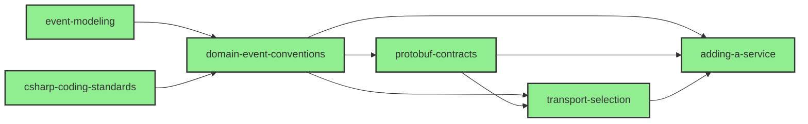
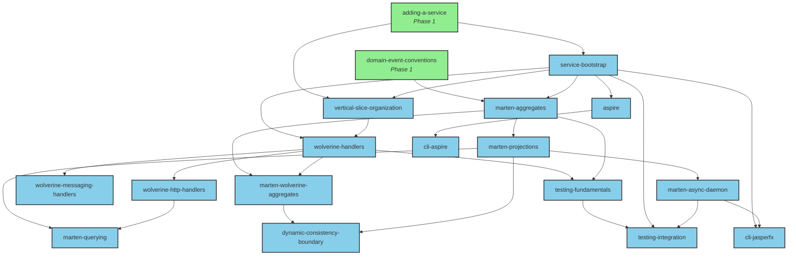
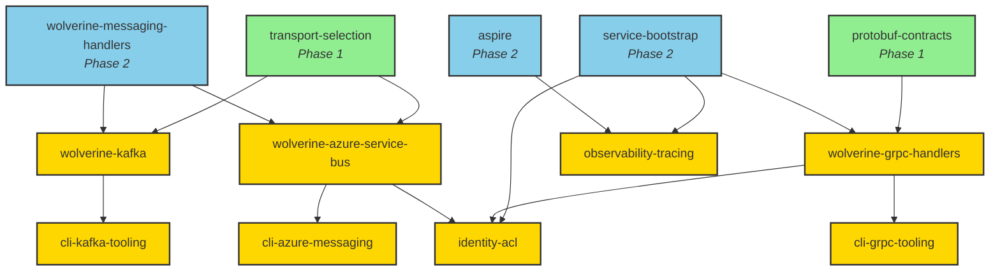

# CritterCab Skills

Implementation pattern documents for CritterCab. Each skill encodes hard-won conventions for a specific aspect of building, designing, or testing the project — so contributors and AI agents don't rediscover known solutions every session.

The skill library follows the [agentskills.io](https://agentskills.io/specification) open standard. Every skill lives in its own directory with a `SKILL.md` containing YAML frontmatter and Markdown instructions. Optional `references/` subdirectories hold deep-dive material loaded on demand.

## How to use this library

Skills are loaded into context by the Claude agent (or read manually by humans) when relevant to the current task. The frontmatter `description` field on each skill is loaded at agent startup to enable activation matching; the body is loaded when the skill is activated.

When working on CritterCab:

- Identify the task type (designing, implementing, testing, deciding).
- Find the relevant entry-point skill in the [Entry-point hubs](#entry-point-hubs) section.
- Load that skill, plus any `Upstream` skills it names.
- Follow `Downstream` references as the work progresses.

Cross-references between skills are explicit. Each skill's `See Also` section names upstream prerequisites and downstream follow-ups, plus external references (ADRs, vision doc, JasperFx ai-skills).

## Status

| Phase | Description | Status |
|---|---|---|
| Phase 1 | Pre-implementation foundations: language standards, design conventions, contract governance, transport decisions, service skeleton | **Complete** (6 skills) |
| Phase 2 | First service implementation: composition root, store wiring, handlers, projections, testing, local-dev orchestration | **Complete** (16 skills) |
| Phase 3 | First cross-service flow: gRPC services, Kafka and ASB transports, identity ACL, distributed observability | **Complete** (8 skills) |
| Phase 4 | Complexity arrives: sagas, advanced patterns, Polecat event sourcing, polyglot Go service, complete observability, advanced testing | **Complete** (9 skills) |
| Phase 5 | Reconciliation pass — cross-check against ai-skills, eliminate duplication, contribute generic patterns upstream | **Substantive deliverable complete** (25 / 39 skills reconciled; 14 remain as Phase 6 follow-up — 3 substantive + 11 placeholder cleanup) |

39 skills authored across Phases 1–4. Phase 5 — the reconciliation pass against [JasperFx ai-skills](#companion-jasperfx-ai-skills) — closed 2026-05-06 with the substantive deliverable complete: every counterpart-rich skill across all four tiers reconciled, 53 upstream-contribution candidates flagged, 16 Cab coverage gaps documented, 2 ai-skills content drift entries surfaced. The remaining 14 skills are predicted out-of-scope (project-specific patterns, Microsoft tooling, generic ecosystem CLIs) and have been deferred to Phase 6. See [skills-foundation-phase-5 retrospective](../retrospectives/skills-foundation-phase-5.md) for the full reconciliation record, upstream-contribution roadmap, and Phase 6 follow-up plan.

## Skill index by cluster

CritterCab's skill clusters split into product/library clusters and topic/concern clusters. The disambiguation rule when a skill spans both axes: pick the cluster that captures the primary value of the skill — the secondary axis goes in `tags`. See `_template/SKILL.md` for the full cluster vocabulary and disambiguation rule.

### Product/library clusters

| Cluster | Authored | Planned |
|---|---|---|
| `core` | `csharp-coding-standards`, `domain-event-conventions`, `event-modeling` | — |
| `wolverine` | `wolverine-handlers`, `wolverine-http-handlers`, `wolverine-messaging-handlers`, `wolverine-grpc-handlers`, `wolverine-grpc-bidirectional-handlers`, `wolverine-kafka`, `wolverine-azure-service-bus`, `wolverine-sagas` | — |
| `marten` | `marten-aggregates`, `marten-wolverine-aggregates`, `marten-projections`, `marten-querying`, `marten-async-daemon`, `dynamic-consistency-boundary` | — |
| `polecat` | `polecat-event-sourcing`, `polecat-document-store` | — |
| `infrastructure` | `aspire`, `cli-aspire`, `cli-jasperfx`, `cli-grpc-tooling`, `cli-kafka-tooling`, `cli-azure-messaging` | — |

### Topic/concern clusters

| Cluster | Authored | Planned |
|---|---|---|
| `distributed-services` | `adding-a-service`, `service-bootstrap`, `vertical-slice-organization`, `distributed-saga-considerations` | — |
| `grpc` | `protobuf-contracts`, `grpc-vs-other-transports` | — |
| `transports` | `transport-selection` | — |
| `identity` | `identity-acl` | — |
| `polyglot` | `polyglot-go-service` | — |
| `testing` | `testing-fundamentals`, `testing-integration`, `testing-advanced` | — |
| `observability` | `observability-tracing`, `observability-metrics` | — |

## Entry-point hubs

When starting a task, the entry-point skill is the first to load. Upstream skills load if unfamiliar; downstream skills load as the work progresses.

### Design and contract tasks

| Task | Entry-point skill | Loads upstream | Loads downstream as work progresses |
|---|---|---|---|
| Designing a new feature or journey | `event-modeling` | — | `domain-event-conventions`, eventual implementation skills |
| Authoring or reviewing C# code | `csharp-coding-standards` | — | `domain-event-conventions`, plus the relevant implementation skill |
| Designing a domain event | `domain-event-conventions` | `csharp-coding-standards` | `marten-aggregates`, transport skills |
| Designing a cross-service contract | `protobuf-contracts` | `csharp-coding-standards`, `domain-event-conventions` | `cli-grpc-tooling`, `wolverine-grpc-handlers` |
| Choosing a transport for a cross-service flow | `transport-selection` | `protobuf-contracts`, `domain-event-conventions` | `wolverine-kafka`, `wolverine-azure-service-bus`, `wolverine-grpc-handlers` |
| Choosing between gRPC and other transports for a specific flow | `grpc-vs-other-transports` | `transport-selection`, `protobuf-contracts` | `wolverine-grpc-handlers`, `wolverine-grpc-bidirectional-handlers`, `wolverine-kafka` |

### Service implementation

| Task | Entry-point skill | Loads upstream | Loads downstream as work progresses |
|---|---|---|---|
| Adding a new service from scratch | `adding-a-service` | `transport-selection`, `protobuf-contracts`, `domain-event-conventions` | `service-bootstrap`, `vertical-slice-organization` |
| Bootstrapping a service's `Program.cs` | `service-bootstrap` | `csharp-coding-standards`, `adding-a-service` | `wolverine-handlers`, `marten-aggregates`, `aspire`, `observability-tracing` |
| Organizing code within a service | `vertical-slice-organization` | `service-bootstrap` | handler and aggregate skills |

### Wolverine handler authoring

| Task | Entry-point skill | Loads upstream | Loads downstream as work progresses |
|---|---|---|---|
| Authoring a Wolverine handler (general) | `wolverine-handlers` | `service-bootstrap`, `vertical-slice-organization` | `wolverine-http-handlers`, `wolverine-messaging-handlers`, `marten-wolverine-aggregates`, `testing-fundamentals` |
| Authoring an HTTP endpoint | `wolverine-http-handlers` | `wolverine-handlers` | `marten-wolverine-aggregates`, `testing-integration` |
| Authoring a messaging handler | `wolverine-messaging-handlers` | `wolverine-handlers` | `marten-wolverine-aggregates`, `testing-integration` |

### Cross-service flows (gRPC, Kafka, ASB)

| Task | Entry-point skill | Loads upstream | Loads downstream as work progresses |
|---|---|---|---|
| Implementing a gRPC service | `wolverine-grpc-handlers` | `protobuf-contracts`, `service-bootstrap` | `cli-grpc-tooling`, `identity-acl`, `observability-tracing`, `wolverine-grpc-bidirectional-handlers` |
| Implementing a bidirectional or server-streaming gRPC service | `wolverine-grpc-bidirectional-handlers` | `wolverine-grpc-handlers`, `protobuf-contracts` | `cli-grpc-tooling`, `testing-advanced` |
| Wiring Kafka for high-volume streams | `wolverine-kafka` | `transport-selection`, `wolverine-messaging-handlers` | `cli-kafka-tooling`, `observability-tracing` |
| Wiring ASB for domain events | `wolverine-azure-service-bus` | `transport-selection`, `wolverine-messaging-handlers` | `cli-azure-messaging`, `observability-tracing` |
| Testing gRPC endpoints from CLI | `cli-grpc-tooling` | `wolverine-grpc-handlers`, `protobuf-contracts` | `identity-acl` for auth tokens |
| Inspecting Kafka topics and messages | `cli-kafka-tooling` | `wolverine-kafka` | `cli-azure-messaging` for Event Hubs management |
| Inspecting ASB queues, topics, and DLQ | `cli-azure-messaging` | `wolverine-azure-service-bus` | — |

### Sagas and orchestration

| Task | Entry-point skill | Loads upstream | Loads downstream as work progresses |
|---|---|---|---|
| Implementing a Wolverine saga | `wolverine-sagas` | `wolverine-messaging-handlers`, `marten-wolverine-aggregates` | `distributed-saga-considerations`, `polecat-event-sourcing` (for Polecat-backed sagas), `testing-advanced` |
| Designing a saga that spans services | `distributed-saga-considerations` | `wolverine-sagas`, `transport-selection` | `testing-advanced` |

### Identity and auth

| Task | Entry-point skill | Loads upstream | Loads downstream as work progresses |
|---|---|---|---|
| Adding auth to a Cab service | `identity-acl` | `service-bootstrap`, `wolverine-grpc-handlers` | `observability-tracing` |
| Obtaining a dev-mode token for CLI testing | `identity-acl` | `cli-grpc-tooling` | — |

### Marten event-sourced and document work

| Task | Entry-point skill | Loads upstream | Loads downstream as work progresses |
|---|---|---|---|
| Implementing an event-sourced aggregate | `marten-aggregates` | `domain-event-conventions`, `service-bootstrap` | `marten-wolverine-aggregates`, `marten-projections` |
| Wiring an aggregate to a Wolverine handler | `marten-wolverine-aggregates` | `marten-aggregates`, `wolverine-handlers` | `dynamic-consistency-boundary`, `testing-integration` |
| Implementing a write path that spans multiple streams | `dynamic-consistency-boundary` | `marten-wolverine-aggregates`, `marten-projections` | `testing-integration` |
| Building a projection (live or async) | `marten-projections` | `marten-aggregates`, `domain-event-conventions` | `marten-async-daemon`, `marten-querying` |
| Querying projected read models | `marten-querying` | `marten-projections` | `wolverine-http-handlers` |
| Configuring the async daemon | `marten-async-daemon` | `marten-projections`, `service-bootstrap` | `testing-integration`, `cli-jasperfx` |

### Polecat event-sourced and document work

| Task | Entry-point skill | Loads upstream | Loads downstream as work progresses |
|---|---|---|---|
| Implementing a Polecat event-sourced aggregate (SQL Server) | `polecat-event-sourcing` | `domain-event-conventions`, `service-bootstrap` | `polecat-document-store`, `wolverine-sagas`, `observability-metrics`, `testing-advanced` |
| Storing documents in Polecat (SQL Server) | `polecat-document-store` | `polecat-event-sourcing` | `testing-advanced` |

### Polyglot services

| Task | Entry-point skill | Loads upstream | Loads downstream as work progresses |
|---|---|---|---|
| Adding a non-.NET service to the system | `polyglot-go-service` | `wolverine-grpc-handlers`, `wolverine-kafka`, `identity-acl`, `observability-tracing` | `testing-advanced` |

### Testing

| Task | Entry-point skill | Loads upstream | Loads downstream as work progresses |
|---|---|---|---|
| Writing a unit test for a handler or aggregate | `testing-fundamentals` | `wolverine-handlers` (or `marten-aggregates`) | `testing-integration` when the test grows beyond pure logic |
| Writing an integration test | `testing-integration` | `testing-fundamentals`, `service-bootstrap`, `marten-async-daemon` | `testing-advanced` for multi-host, gRPC streaming, vhost isolation, and polyglot patterns |
| Writing an advanced integration test | `testing-advanced` | `testing-integration`, plus the Phase 4 implementation skill the test exercises | — (terminal) |

### Infrastructure and tooling

| Task | Entry-point skill | Loads upstream | Loads downstream as work progresses |
|---|---|---|---|
| Setting up local-dev orchestration | `aspire` | `service-bootstrap` | `cli-aspire` |
| Operating the AppHost from a terminal or CI | `cli-aspire` | `aspire` | `cli-jasperfx` for service-internal commands |
| Running CLI commands inside a Cab service | `cli-jasperfx` | `service-bootstrap` | `cli-aspire` for AppHost-level orchestration |

### Observability

| Task | Entry-point skill | Loads upstream | Loads downstream as work progresses |
|---|---|---|---|
| Setting up distributed tracing | `observability-tracing` | `service-bootstrap`, `aspire` | `observability-metrics`, `testing-advanced` |
| Setting up metrics (counters, histograms, observable gauges) | `observability-metrics` | `observability-tracing`, `service-bootstrap` | `testing-advanced` |
| Understanding Wolverine's trace spans | `observability-tracing` | `wolverine-handlers` | — |

## Cross-reference graph

### Phase 1 — Foundations



### Phase 2 — First service implementation



### Phase 3 — First cross-service flow



The Phase 3 graph shows three transport-specific vertical flows (gRPC, Kafka, ASB) anchored on Phase 1 decision skills (`transport-selection`, `protobuf-contracts`) and Phase 2 handler and composition skills (`wolverine-messaging-handlers`, `service-bootstrap`). Identity and observability cut across the transport flows — `identity-acl` draws from gRPC handlers and ASB, while `observability-tracing` draws from the service bootstrap and Aspire foundation. Phase 4 extends this with sagas, Polecat as an alternative event store, the polyglot Go service, bidirectional gRPC, and the metrics half of the observability story.

### Phase 4 — Sagas, Polecat, polyglot, complete observability and testing

```mermaid
graph TB
    %% Anchors from earlier phases
    DEC[domain-event-conventions<br/><i>Phase 1</i>]
    TS[transport-selection<br/><i>Phase 1</i>]
    PC[protobuf-contracts<br/><i>Phase 1</i>]
    SB[service-bootstrap<br/><i>Phase 2</i>]
    WMH[wolverine-messaging-handlers<br/><i>Phase 2</i>]
    MWA[marten-wolverine-aggregates<br/><i>Phase 2</i>]
    TI[testing-integration<br/><i>Phase 2</i>]
    WGH[wolverine-grpc-handlers<br/><i>Phase 3</i>]
    WK[wolverine-kafka<br/><i>Phase 3</i>]
    IACL[identity-acl<br/><i>Phase 3</i>]
    OT[observability-tracing<br/><i>Phase 3</i>]

    %% Bidirectional gRPC and transport comparison
    WGBH[wolverine-grpc-bidirectional-handlers]
    GVOT[grpc-vs-other-transports]

    PC --> WGBH
    WGH --> WGBH
    TS --> GVOT

    %% Sagas and distributed orchestration
    WS[wolverine-sagas]
    DSC[distributed-saga-considerations]

    WMH --> WS
    MWA --> WS
    WS --> DSC

    %% Polecat — SQL Server alternative event store
    PES[polecat-event-sourcing]
    PDS[polecat-document-store]

    DEC --> PES
    SB --> PES
    PES --> PDS

    %% Polyglot Go service
    PGS[polyglot-go-service]

    WGH --> PGS
    WK --> PGS
    IACL --> PGS
    OT --> PGS

    %% Metrics — the companion to Phase 3 tracing
    OM[observability-metrics]

    OT --> OM

    %% Advanced testing — the terminal node every Phase 4 skill funnels into
    TA[testing-advanced]

    TI --> TA
    WGBH --> TA
    WS --> TA
    PES --> TA
    PGS --> TA
    OM --> TA

    classDef phase1 fill:#90ee90,stroke:#333,stroke-width:2px
    classDef phase2 fill:#87ceeb,stroke:#333,stroke-width:2px
    classDef phase3 fill:#ffd700,stroke:#333,stroke-width:2px
    classDef phase4 fill:#dda0dd,stroke:#333,stroke-width:2px

    class DEC,TS,PC phase1
    class SB,WMH,MWA,TI phase2
    class WGH,WK,IACL,OT phase3
    class WGBH,GVOT,WS,DSC,PES,PDS,PGS,OM,TA phase4
```



The Phase 4 graph shows complexity arriving from multiple directions. Sagas (`wolverine-sagas`, `distributed-saga-considerations`) build on the Phase 2 messaging-handler and aggregate-handler skills. Polecat (`polecat-event-sourcing`, `polecat-document-store`) anchors on the Phase 1 domain-event conventions and Phase 2 service-bootstrap as the SQL-Server alternative to Marten on PostgreSQL. The polyglot Go service (`polyglot-go-service`) braids Phase 3 cross-service primitives (gRPC, Kafka, identity, tracing) into a non-.NET runtime. `observability-metrics` is the metric companion to Phase 3's `observability-tracing`. `wolverine-grpc-bidirectional-handlers` and `grpc-vs-other-transports` complete the gRPC story. `testing-advanced` is the terminal node — every other Phase 4 implementation skill funnels into it because the test patterns it documents (multi-host scenarios, streaming gRPC harnesses, dynamic database-per-fixture, vhost isolation, polyglot boundary tests, OTel signal verification) are how each new capability gets exercised end-to-end.

Phase 5 is the reconciliation pass against [JasperFx ai-skills](#companion-jasperfx-ai-skills). Phase 4 deliberately authored some skills (notably `wolverine-sagas`, `polecat-event-sourcing`, `polecat-document-store`) ahead of comparable ai-skills coverage where Cab needed the conventions to make implementation decisions. The Phase 5 pass will identify what's truly Cab-specific (kept here), what's generic enough to contribute upstream (offered to ai-skills), and what overlaps and should be deduplicated by deferring to ai-skills with a thinner Cab-specific layer on top.

## Companion: JasperFx ai-skills

Several CritterCab skills cross-reference the JasperFx [`ai-skills`](https://github.com/jasperfx/ai-skills) library — a paid, proprietary collection of generic Critter Stack skills (Wolverine, Marten, Polecat). CritterCab's skills are deliberately designed to **defer to ai-skills for generic mechanics** and **document project-specific decisions on top.**

Where applicable, CritterCab skills name their ai-skills counterparts in the `External` section of `See Also`. Contributors with an ai-skills license install them at the user level so they're available alongside CritterCab's project-local skills:

```bash
# Install all ai-skills globally (license required)
npx skills add https://github.com/jasperfx/ai-skills/tree/v1.1.0/skills --skill '*' -g -a claude-code
```

CritterCab does not duplicate or paraphrase ai-skills content. The composition is layered, not extracted. Phase 5 of the skill plan is a dedicated reconciliation pass: cross-check against ai-skills, eliminate any duplication that crept in, and contribute generic patterns upstream where appropriate.

## Authoring new skills

Use `_template/SKILL.md` as the starting point:

```bash
cp -r docs/skills/_template docs/skills/<your-skill-name>
```

Then:

1. Update the frontmatter (`name`, `description`, `cluster`, `tags`).
2. Replace placeholder content with the actual skill body.
3. Wire `See Also` references with upstream/downstream/external links.
4. Update this README's cluster index and (if the new skill changes the topology meaningfully) the cross-reference graph.

The template's inline comments document the conventions in detail (frontmatter fields, length guideline, section structure, cross-reference format).

## Conventions reference

- **Skill organization**: per [agentskills.io](https://agentskills.io/specification) — directory + `SKILL.md` + optional `references/`.
- **Length guideline**: aim for `SKILL.md` under 500 lines; pragmatic, not strict. Move conditionally-loaded deep-dive content to `references/`.
- **Domain examples**: ground in CritterCab's actual bounded contexts (Trips, Dispatch, Telemetry, Pricing, Identity, etc.) — not generic placeholders.
- **No back-references to CritterBids or CritterSupply**: these are sibling reference projects, not CritterCab's source of truth.
- **README update at each phase boundary**: this README is the navigation hub. It's updated at the end of every phase to reflect newly-authored skills and any topology shifts.
