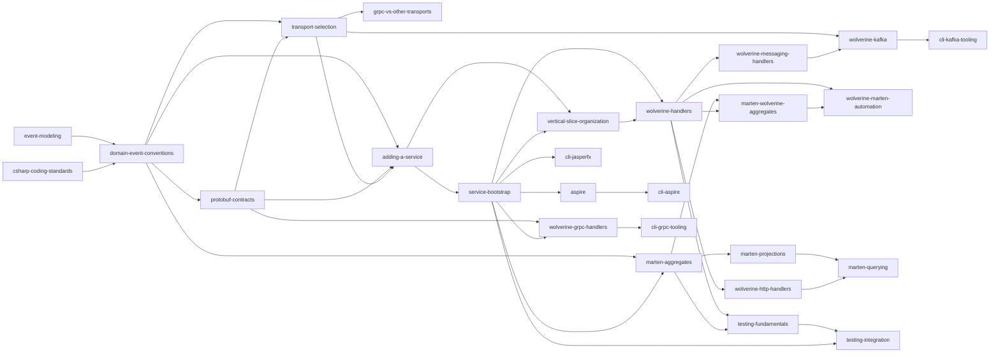

# CritterCab Skills

Implementation pattern documents for CritterCab. Each skill encodes conventions for one aspect of building, designing or testing the project, so contributors and AI agents do not rediscover known solutions every session.

The library follows the [agentskills.io](https://agentskills.io/specification) open standard. Every skill lives in its own directory with a `SKILL.md` containing YAML frontmatter and Markdown instructions; optional `references/` subdirectories hold deep-dive material loaded on demand.

**Every skill here is grounded in code in this repository.** A skill is admitted when code exercises what it describes, under CI, in the same PR or the next (the rule of admission in [`docs/vision/README.md`](../vision/README.md) § Technology stack). Skills for technology the repository does not use live in [`archive/`](./archive/README.md), with a line each on what they covered and why there is no code behind them; a skill moves back when its first exercising code lands. Known gaps between a skill and the code are tracked in [`DEBT.md`](./DEBT.md).

## How to use this library

Skills are loaded into context by an agent (or read by a person) when relevant to the task. Each skill's frontmatter `description` drives activation matching; the body is loaded when the skill is activated.

The README offers four navigation surfaces: the [index by cluster](#skill-index-by-cluster) (grouped by primary value), the [index by tag](#skill-index-by-tag) (cross-cutting concerns), the [entry-point hubs](#entry-point-hubs) (task-keyed routing with upstream prerequisites and downstream follow-ups), and the [cross-reference graph](#cross-reference-graph).

When working on CritterCab:

- Identify the task type (designing, implementing, testing, deciding).
- Find the entry-point skill in [Entry-point hubs](#entry-point-hubs).
- Load that skill, plus any `Upstream` skills it names.
- Follow `Downstream` references as the work progresses.

Each skill's `See Also` section names its upstream prerequisites, downstream follow-ups and external references (ADRs, the vision, JasperFx ai-skills). A skill name that appears there but not in the indexes below is archived.

## Skill index by cluster

Clusters split into product/library clusters and topic/concern clusters. When a skill spans both, it sits in the cluster that captures its primary value and carries the other axis in `tags`. See `_template/SKILL.md` for the cluster vocabulary.

### Product/library clusters

| Cluster | Skills |
|---|---|
| `core` | `csharp-coding-standards`, `domain-event-conventions`, `event-modeling` |
| `wolverine` | `wolverine-handlers`, `wolverine-http-handlers`, `wolverine-messaging-handlers`, `wolverine-grpc-handlers`, `wolverine-kafka`, `wolverine-marten-automation` |
| `marten` | `marten-aggregates`, `marten-wolverine-aggregates`, `marten-projections`, `marten-querying` |
| `infrastructure` | `aspire`, `cli-aspire`, `cli-jasperfx`, `cli-grpc-tooling`, `cli-kafka-tooling` |

### Topic/concern clusters

| Cluster | Skills |
|---|---|
| `distributed-services` | `adding-a-service`, `service-bootstrap`, `vertical-slice-organization` |
| `grpc` | `protobuf-contracts`, `grpc-vs-other-transports` |
| `transports` | `transport-selection` |
| `testing` | `testing-fundamentals`, `testing-integration` |

## Skill index by tag

Tags surface a skill's secondary dimensions. The high-frequency tags below are curated for navigation; each skill's frontmatter has its full list.

### Stack

| Tag | Skills |
|---|---|
| `wolverine` | `wolverine-handlers`, `wolverine-http-handlers`, `wolverine-messaging-handlers`, `wolverine-grpc-handlers`, `wolverine-kafka`, `wolverine-marten-automation`, `marten-wolverine-aggregates`, `service-bootstrap`, `transport-selection` |
| `marten` | `marten-aggregates`, `marten-wolverine-aggregates`, `marten-projections`, `marten-querying`, `domain-event-conventions`, `service-bootstrap`, `wolverine-marten-automation` |
| `aspire` | `aspire`, `cli-aspire`, `adding-a-service`, `service-bootstrap` |
| `grpc` | `wolverine-grpc-handlers`, `protobuf-contracts`, `grpc-vs-other-transports`, `cli-grpc-tooling`, `transport-selection` |
| `kafka` | `wolverine-kafka`, `cli-kafka-tooling`, `aspire`, `transport-selection`, `grpc-vs-other-transports`, `testing-integration` |
| `dotnet` | `csharp-coding-standards`, `adding-a-service` |

### Patterns

| Tag | Skills |
|---|---|
| `event-sourcing` | `domain-event-conventions`, `marten-aggregates`, `wolverine-marten-automation` |
| `decider-pattern` | `marten-aggregates`, `marten-wolverine-aggregates`, `marten-projections`, `testing-fundamentals`, `wolverine-marten-automation` |
| `projections` | `marten-projections`, `cli-jasperfx` |
| `handlers` | `wolverine-handlers`, `wolverine-http-handlers`, `wolverine-messaging-handlers`, `marten-wolverine-aggregates`, `wolverine-marten-automation` |
| `decision-framework` | `transport-selection`, `grpc-vs-other-transports` |
| `conventions` | `csharp-coding-standards`, `domain-event-conventions`, `wolverine-handlers`, `vertical-slice-organization` |
| `domain-modeling` | `csharp-coding-standards`, `domain-event-conventions` |

### Activities

| Tag | Skills |
|---|---|
| `testing` | `testing-fundamentals`, `testing-integration` |
| `cli` | `cli-aspire`, `cli-jasperfx`, `cli-grpc-tooling`, `cli-kafka-tooling` |
| `ci` | `cli-aspire`, `cli-jasperfx`, `cli-grpc-tooling` |
| `bootstrap` | `service-bootstrap`, `adding-a-service` |
| `debugging` | `cli-kafka-tooling` |
| `event-modeling` | `event-modeling` |

### ADR cross-references

| ADR | Skills tagged |
|---|---|
| `adr-005` (transport selection) | `transport-selection`, `grpc-vs-other-transports`, `wolverine-kafka` |
| `adr-009` (protobuf contracts as first-class artifacts) | `protobuf-contracts`, `cli-grpc-tooling` |

## Entry-point hubs

When starting a task, load the entry-point skill first; upstream skills if unfamiliar; downstream skills as the work progresses.

### Design and contract tasks

| Task | Entry-point skill | Loads upstream | Loads downstream as work progresses |
|---|---|---|---|
| Modelling a new chapter, cutting slices, writing scenarios | `event-modeling` | — | `domain-event-conventions`, then the implementation skill for the slice's pattern |
| Authoring or reviewing C# code | `csharp-coding-standards` | — | `domain-event-conventions`, plus the relevant implementation skill |
| Designing a domain event | `domain-event-conventions` | `csharp-coding-standards` | `marten-aggregates`, transport skills |
| Designing a cross-service contract | `protobuf-contracts` | `csharp-coding-standards`, `domain-event-conventions` | `cli-grpc-tooling`, `wolverine-grpc-handlers`, `wolverine-kafka` |
| Choosing a transport for a cross-service flow | `transport-selection` | `protobuf-contracts`, `domain-event-conventions` | `wolverine-kafka`, `wolverine-grpc-handlers` |
| Choosing between gRPC and other transports for a specific flow | `grpc-vs-other-transports` | `transport-selection`, `protobuf-contracts` | `wolverine-grpc-handlers`, `wolverine-kafka` |

### Service implementation

| Task | Entry-point skill | Loads upstream | Loads downstream as work progresses |
|---|---|---|---|
| Adding a new service from scratch | `adding-a-service` | `transport-selection`, `protobuf-contracts`, `domain-event-conventions` | `service-bootstrap`, `vertical-slice-organization`, `aspire` |
| Bootstrapping a service's `Program.cs` | `service-bootstrap` | `csharp-coding-standards`, `adding-a-service` | `wolverine-handlers`, `marten-aggregates`, `aspire` |
| Organizing code within a service | `vertical-slice-organization` | `service-bootstrap` | handler and aggregate skills |

### Wolverine handler authoring

| Task | Entry-point skill | Loads upstream | Loads downstream as work progresses |
|---|---|---|---|
| Authoring a Wolverine handler (general) | `wolverine-handlers` | `service-bootstrap`, `vertical-slice-organization` | `wolverine-http-handlers`, `wolverine-messaging-handlers`, `marten-wolverine-aggregates`, `testing-fundamentals` |
| Authoring an HTTP endpoint (including boundary validation) | `wolverine-http-handlers` | `wolverine-handlers` | `marten-wolverine-aggregates`, `testing-integration` |
| Authoring a messaging handler | `wolverine-messaging-handlers` | `wolverine-handlers` | `marten-wolverine-aggregates`, `testing-integration` |
| Authoring an event-triggered or timer-driven automation | `wolverine-marten-automation` | `wolverine-handlers`, `marten-wolverine-aggregates` | `testing-fundamentals` |

### Cross-service flows

| Task | Entry-point skill | Loads upstream | Loads downstream as work progresses |
|---|---|---|---|
| Implementing a gRPC service (unary, server-streaming, client-streaming) | `wolverine-grpc-handlers` | `protobuf-contracts`, `service-bootstrap` | `cli-grpc-tooling`, `testing-integration` |
| Publishing to or consuming from Kafka | `wolverine-kafka` | `transport-selection`, `wolverine-messaging-handlers`, `protobuf-contracts` | `cli-kafka-tooling`, `testing-integration` |
| Testing gRPC endpoints from the CLI | `cli-grpc-tooling` | `wolverine-grpc-handlers`, `protobuf-contracts` | — |
| Inspecting Kafka topics and messages | `cli-kafka-tooling` | `wolverine-kafka` | — |

### Marten event-sourced and document work

| Task | Entry-point skill | Loads upstream | Loads downstream as work progresses |
|---|---|---|---|
| Implementing an event-sourced aggregate | `marten-aggregates` | `domain-event-conventions`, `service-bootstrap` | `marten-wolverine-aggregates`, `marten-projections` |
| Wiring an aggregate to a Wolverine handler | `marten-wolverine-aggregates` | `marten-aggregates`, `wolverine-handlers` | `testing-integration` |
| Seeding or reconfiguring a configuration-as-events stream | `marten-wolverine-aggregates` | `domain-event-conventions` | `wolverine-http-handlers`, `testing-integration` |
| Writing a plain (non-event-sourced) document | `marten-wolverine-aggregates` | `service-bootstrap` | `marten-querying`, `testing-integration` |
| Building a projection | `marten-projections` | `marten-aggregates`, `domain-event-conventions` | `marten-querying` |
| Querying documents and read models | `marten-querying` | `marten-projections` | `wolverine-http-handlers` |

### Testing

| Task | Entry-point skill | Loads upstream | Loads downstream as work progresses |
|---|---|---|---|
| Writing a unit test for a handler or aggregate | `testing-fundamentals` | `wolverine-handlers` (or `marten-aggregates`) | `testing-integration` when the test grows beyond pure logic |
| Writing an integration test (Alba, Testcontainers, Kafka) | `testing-integration` | `testing-fundamentals`, `service-bootstrap` | — |

### Infrastructure and tooling

| Task | Entry-point skill | Loads upstream | Loads downstream as work progresses |
|---|---|---|---|
| Changing local orchestration (the AppHost project) | `aspire` | `service-bootstrap` | `cli-aspire` |
| Operating the AppHost from a terminal or CI | `cli-aspire` | `aspire` | `cli-jasperfx` |
| Running CLI commands inside a service | `cli-jasperfx` | `service-bootstrap` | `cli-aspire` |

## Cross-reference graph

Upstream to downstream across the library. The phase-by-phase graphs that recorded the order the library was first authored in were retired with the archive; the authoring history is in the skills-foundation retrospectives under [`docs/retrospectives/`](../retrospectives/).


```mermaid
graph LR
    %% Design and contracts
    EM[event-modeling]
    CCS[csharp-coding-standards]
    DEC[domain-event-conventions]
    PC[protobuf-contracts]
    TS[transport-selection]
    GVOT[grpc-vs-other-transports]

    EM --> DEC
    CCS --> DEC
    DEC --> PC
    DEC --> TS
    PC --> TS
    TS --> GVOT

    %% Service composition
    AS[adding-a-service]
    SB[service-bootstrap]
    VSO[vertical-slice-organization]
    ASP[aspire]

    DEC --> AS
    PC --> AS
    TS --> AS
    AS --> SB
    AS --> VSO
    SB --> VSO
    SB --> ASP

    %% Handlers
    WH[wolverine-handlers]
    WHH[wolverine-http-handlers]
    WMH[wolverine-messaging-handlers]
    WGH[wolverine-grpc-handlers]
    WK[wolverine-kafka]
    WMA[wolverine-marten-automation]

    SB --> WH
    VSO --> WH
    WH --> WHH
    WH --> WMH
    PC --> WGH
    SB --> WGH
    TS --> WK
    WMH --> WK

    %% Marten
    MA[marten-aggregates]
    MWA[marten-wolverine-aggregates]
    MP[marten-projections]
    MQ[marten-querying]

    DEC --> MA
    SB --> MA
    MA --> MWA
    WH --> MWA
    MA --> MP
    MP --> MQ
    WHH --> MQ
    WH --> WMA
    MWA --> WMA

    %% Testing
    TF[testing-fundamentals]
    TI[testing-integration]

    WH --> TF
    MA --> TF
    TF --> TI
    SB --> TI

    %% Tooling
    CLA[cli-aspire]
    CLJ[cli-jasperfx]
    CGT[cli-grpc-tooling]
    CKT[cli-kafka-tooling]

    ASP --> CLA
    SB --> CLJ
    WGH --> CGT
    WK --> CKT
```

## Companion: JasperFx ai-skills

Several CritterCab skills cross-reference the JasperFx [`ai-skills`](https://github.com/jasperfx/ai-skills) library — a paid, proprietary collection of generic Critter Stack skills (Wolverine, Marten, Polecat). CritterCab's skills are deliberately designed to **defer to ai-skills for generic mechanics** and **document project-specific decisions on top.**

Where applicable, CritterCab skills name their ai-skills counterparts in the `External` section of `See Also`. Contributors with an ai-skills license install them at the user level so they're available alongside CritterCab's project-local skills:

```bash
# Install all ai-skills globally (license required)
npx skills add https://github.com/jasperfx/ai-skills/tree/v1.1.0/skills --skill '*' -g -a claude-code
```

CritterCab does not duplicate or paraphrase ai-skills content. The composition is layered, not extracted. Phase 5 of the skill plan was a dedicated reconciliation pass that closed 2026-05-06: cross-checked against ai-skills, eliminated duplication where it crept in, and produced a 53-entry upstream-contribution roadmap captured in the [skills-foundation-phase-5 retrospective](../retrospectives/skills-foundation-phase-5.md).

## Authoring new skills

Use `_template/SKILL.md` as the starting point:

```bash
cp -r docs/skills/_template docs/skills/<your-skill-name>
```

Then:

1. Update the frontmatter (`name`, `description`, `cluster`, `tags`).
2. Replace placeholder content with the actual skill body.
3. Wire `See Also` references with upstream/downstream/external links.
4. Update this README's cluster index, tag index, and entry-point hubs; if the new skill changes the topology meaningfully, update the cross-reference graph as well.

The template's inline comments document the conventions in detail (frontmatter fields, length guideline, section structure, cross-reference format).

## Conventions reference

- **Skill organization**: per [agentskills.io](https://agentskills.io/specification) — directory + `SKILL.md` + optional `references/`.
- **Length guideline**: aim for `SKILL.md` under 500 lines; pragmatic, not strict. Move conditionally-loaded deep-dive content to `references/`.
- **Domain examples**: ground in CritterCab's actual bounded contexts (Dispatch, Telemetry, Driver Profile, Trips, Identity), preferring the code that exists over contexts not yet built — not generic placeholders.
- **No back-references to CritterBids or CritterSupply**: these are sibling reference projects, not CritterCab's source of truth.
- **Rule of admission**: a skill is written (or moved back from `archive/`) only in the PR that adds code exercising it, or the next one. A skill describing technology the repository does not use goes to `archive/`.
- **README update on each new skill addition**: this README is the navigation hub. Update the cluster index, tag index, entry-point hubs, and (if the new skill changes the topology meaningfully) the cross-reference graph in the same PR that adds the skill.
- **Skill-file gaps surfaced during sessions go in [`DEBT.md`](./DEBT.md)**: a retro that names a skill-file gap should add the corresponding row to `DEBT.md` in the same PR. Gaps are drained by dedicated `tidy: skills` PRs per the **Session and PR cadence** rule in [`docs/prompts/README.md`](../prompts/README.md#session-and-pr-cadence). Session-runner-blocking fixes are the exception and may ride in the surfacing session's PR.
